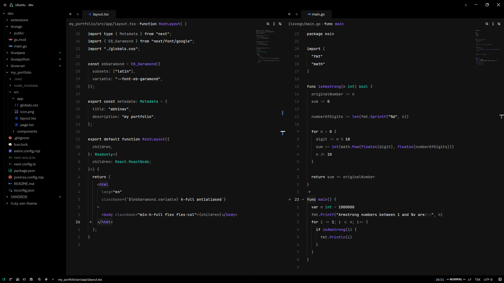
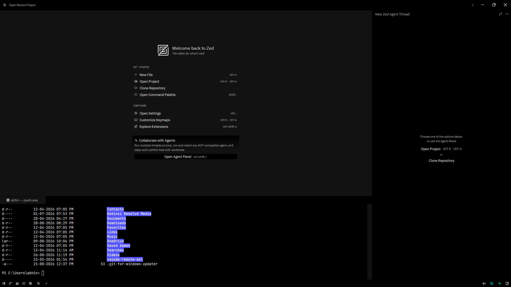

# Truly Zen

A Zed editor theme for total concentration. Dark, minimal, and just a little bit mysterious.



## What's the vibe?

Truly Zen is what happens when you take a pure black canvas and sprinkle in teal accents like digital tea leaves. It's designed to disappear into the background so you can focus on what actually matters: your code.

**The aesthetic:**
- Pitch black backgrounds (#000000) because why waste pixels?
- Teal highlights (#14B8A6) that pop without screaming
- Soft grey text that doesn't strain your eyes at 3am
- Purple functions (#9D70FF) because life needs a little color
- White keywords for maximum readability

**Two flavors included:**
- **Truly Zen Dark** — the classic experience
- **Truly Zen Dark Italics** — same zen, but with italics on keywords and comments for extra flow state



## Installation

### From the Extension Store (when it's published)

1. Open Zed
2. Press `ctrl+shift+x` (or `cmd+shift+x` on macOS) to open Extensions
3. Search for "Truly Zen"
4. Click Install
5. Select it from the theme selector with `ctrl+k ctrl+t`

### As a Dev Extension (for testing)

1. Clone this repo:
   ```bash
   git clone https://github.com/abhinaaaavvv/truly-zen.git
   ```
2. Open Zed
3. Open the command palette with `ctrl+shift+p`
4. Run `zed: Install Dev Extension`
5. Select the cloned directory
6. Pick your theme from `ctrl+k ctrl+t`

### Manual Installation

1. Copy `themes/truly-zen.json` to:
   - **macOS/Linux:** `~/.config/zed/themes/truly-zen.json`
   - **Windows:** `%USERPROFILE%\AppData\Roaming\Zed\themes\truly-zen.json`
2. Restart Zed
3. Select the theme with `ctrl+k ctrl+t`

## Settings

If you want to set it as your default theme, add this to your `settings.json`:

```json
{
  "theme": "Truly Zen Dark"
}
```

Or for the italics version:

```json
{
  "theme": "Truly Zen Dark Italics"
}
```

For dark/light mode switching:

```json
{
  "theme": {
    "dark": "Truly Zen Dark",
    "light": "One Light",
    "mode": "system"
  }
}
```

## Color Palette

| Element | Color |
|---------|-------|
| Background | `#000000` |
| Editor | `#121212` |
| Text | `#e5e5e5` |
| Accent | `#14B8A6` (teal) |
| Functions | `#9D70FF` (purple) |
| Types | `#2DD4BF` (cyan) |
| Keywords | `#F5F5F5` (white, italic) |
| Comments | `#525252` (grey, italic) |
| Strings | `#F5F5F5` (white) |
| Variables | `#a3a3a3` (light grey) |

## Terminal Colors

The theme includes a full set of terminal colors that match the aesthetic:

- Bright greens and cyans for that hacker vibe
- Classic reds for errors (obviously)
- Soft yellows for warnings
- The usual ANSI suspects, all tuned to play nice with the dark backgrounds

## Contributing

Found a bug? Want to add something? PRs are welcome. Just keep the zen intact.

## License

MIT — use it, modify it, make it your own.

---

*Made with focus in mind. Now go ship something.* ✨
